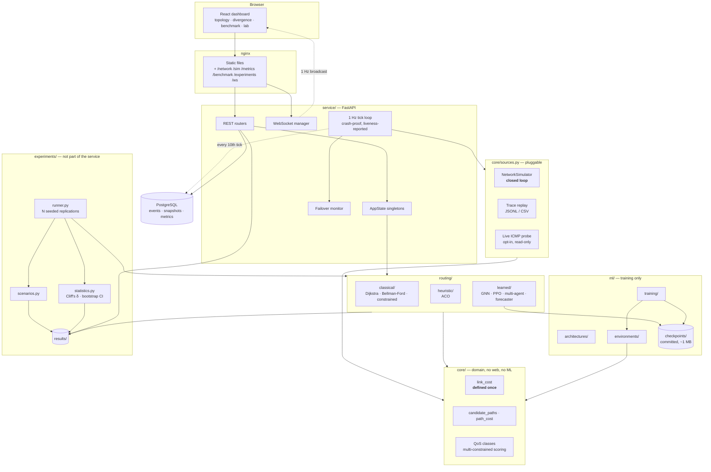
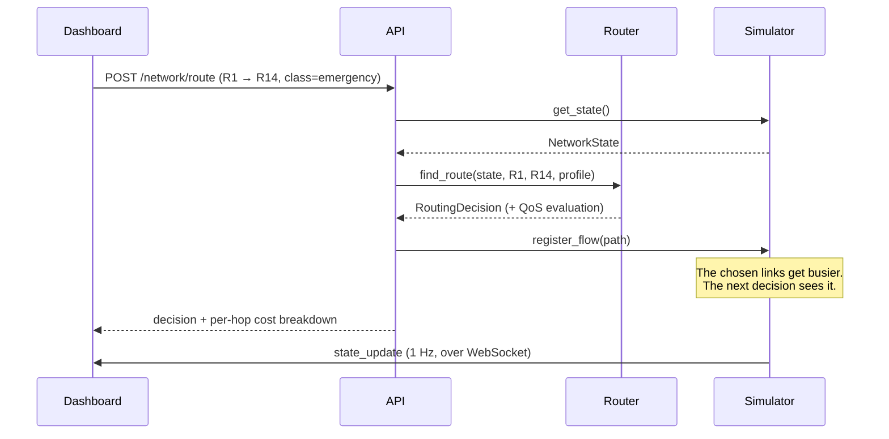
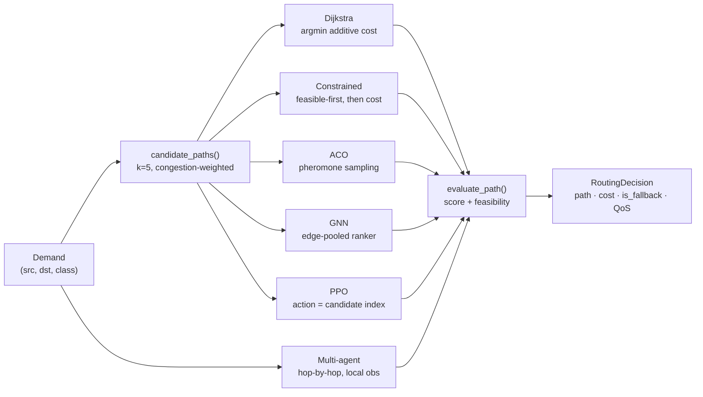

# System architecture

Thirteen documents contained zero pictures. This is the picture.

## Layered view

**The one thing to notice:** `core/` has no arrow pointing into the web service,
the ML stack or the benchmark. It is the scientific core, and it is deliberately
usable on its own. The previous layout buried it inside `backend/`, where it
looked like an implementation detail of a web application.

## The closed loop

This is the change that makes the project's central question answerable at all.

Before this, `register_flow` did not exist. Utilization evolved as a random walk
independent of routing, so no decision anyone made changed anything — which made
per-path latency minimisation exactly optimal and Dijkstra unbeatable by
construction.

## Where a routing decision comes from

Every candidate-based router draws from the **same** generator, in the **same**
order. Three different generators used to exist — training ordered candidates by
congestion-adjusted cost, inference by hop count on an unweighted graph, and the
GNN trainer by raw BFS order — so action index *k* meant a different path in
each. That is invisible when it happens and it invalidates every learned result.
